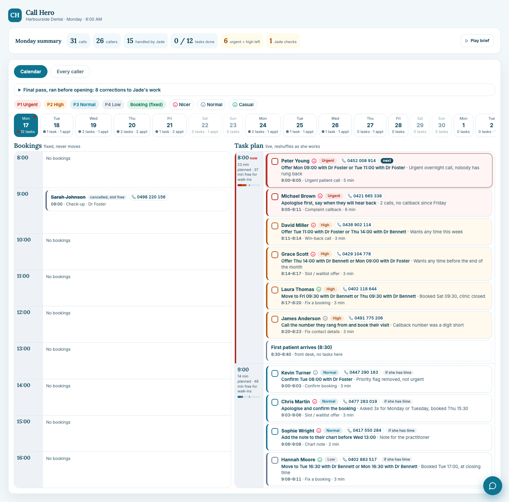
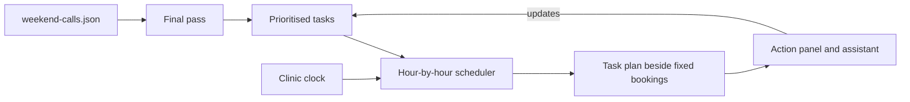

# Call Hero: Monday Morning Screen

> **One screen, ninety seconds.** It turns the 31 calls Jade, an AI receptionist, answered over a closed weekend into a prioritised, time-boxed Monday plan for Harbourside Dental.

**[Live demo](https://call-hero-ai-receptionist.vercel.app/)** · [Run locally](#run-locally) · [How it works](#how-it-works) · [Limitations](#limitations) · [Next steps](#next-steps)

Built for the CallHero hackathon (UTS Startups, 30 September 2026).



## Contents

- [The problem](#the-problem)
- [What it does](#what-it-does)
- [How it works](#how-it-works)
- [Try the demo](#try-the-demo)
- [Run locally](#run-locally)
- [Tech stack](#tech-stack)
- [Project structure](#project-structure)
- [The data](#the-data)
- [Design decisions](#design-decisions)
- [Limitations](#limitations)
- [Next steps](#next-steps)
- [Contributing](#contributing)

## The problem

Harbourside Dental closed at 5pm on Friday. Over the weekend the phone kept ringing and Jade answered every call: 31 calls from 26 callers. At 8am on Monday the owner walks in and her first patient arrives at 8:30. She has ninety seconds to work out what happened and what to do first.

Jade's summaries are accurate about what callers said, but she also made mistakes: she told people nothing was available while cancelled slots were open, booked a child in on a Saturday when the clinic is closed, captured a phone number a digit short, and flagged a booking as priority while a genuinely urgent call went unbooked. A plain list of calls would hide all of that.

## What it does

- **Puts what matters first.** The 2:14am urgent call and the repeat billing complaint sit at the top. The 15 routine calls Jade handled fully are left out on purpose.
- **Shows a working day, not a list.** Fixed bookings sit beside a live hour-by-hour task plan that follows the clinic clock.
- **Reshuffles as she works.** Finish early and lower-priority tasks move up. Fall behind and they slide to the next hour.
- **Corrects Jade's mistakes.** A "final pass" re-reads the call log before opening and fixes them, then puts a first-choice and a backup slot on each card.
- **Tells her how to sound.** Every task carries a mood cue (Nicer, Normal, Casual) and a tap-to-call number.
- **Turns a task into an action in a click.** Each task opens one panel with a pre-drafted text, a call, or a booking.
- **Understands a typed outcome.** A small assistant takes "Peter chose Tue 18 Nov 11:00" and updates the calendar, task list and counts.

## How it works



**1. Priority.** Each task gets a priority from simple rules over Jade's own labels in the data (`flagged`, `outcome`, `sentiment`). The JSON has no priority field, so the rules are ours, in [`engine/tasks.ts`](src/features/calendars/engine/tasks.ts).

| Level      | Test                                                        | Examples                                                       |
| ---------- | ----------------------------------------------------------- | -------------------------------------------------------------- |
| **Urgent** | Someone is hurting or angry now, and waiting makes it worse | An urgent call that was never booked; a repeat complaint       |
| **High**   | We are about to lose a patient or booking                   | Told "no availability"; wrong phone number; closed-day booking |
| **Normal** | Needs doing, nothing is lost if it waits a little           | Confirm a booking; a chart note                                |
| **Low**    | Housekeeping                                                | Reminders; rebook callbacks; the referral call                 |

**2. Scheduling.** The plan follows the real time in the clinic's timezone.

- Urgent and High tasks take the first hour. Normal and Low wait in later hours, tagged "if she has time".
- About 30 minutes an hour stay free for walk-ins. Urgent tasks can use the whole hour, High tasks can stretch to 40 minutes.
- Once every Urgent and High task is ticked, the buffer lifts and Normal and Low tasks move up into the rest of the hour, one at a time.
- Let an hour pass and what is left moves to the next hour with room, in priority order. Anything that will not fit before 5pm rolls to the next open day.
- Tasks skip lunch (14:00 to 14:45), the 8:30 first patient, and a short check-in window around each booking.
- A reminder expires once its appointment starts. Timed tasks, such as the referral call after 14:00, wait for their time.

**3. Final pass.** Before opening, a second layer re-reads the call log and corrects Jade's work. It removes a priority flag that was not urgent, flags the Saturday booking and the short phone number, and offers the cancelled slots to callers who were told nothing was available. Offers are recomputed against the clock, so a slot that has already passed is never suggested, and each free slot is offered to one person first.

**4. Mood.** Nicer if any call was negative or flagged as sensitive, Casual if the latest call was positive, otherwise Normal.

## Try the demo

Open the [live demo](https://call-hero-ai-receptionist.vercel.app/), or run it locally, and:

1. Read the **Monday summary** bar: calls, callers, what Jade handled, and what is left.
2. Open **Final pass** to see the corrections made to Jade's work.
3. On the **Calendar** tab, compare the fixed **Bookings** (left) with the live **Task plan** (right).
4. Tick the Urgent and High tasks and watch the Normal and Low tasks move up into the first hour.
5. Leave it open: the plan is recomputed every minute from the real clinic time, so anything unfinished slides into the next hour as the day goes. (The app has no fast-forward control. The standalone prototype does: open `src/features/calendars/prototype/dashboard.html` and press **Demo controls**.)
6. Open a task to edit its drafted text, call, or book a slot. Then type an outcome such as `Peter chose Tue 18 Nov 11:00` into the assistant.
7. Check the **Every caller** tab for all 26 callers, with their mood, reason and what Jade did.

## Run locally

**Prerequisites:** Node.js 22 or later (developed on Node 25) and npm.

```bash
git clone https://github.com/An-nay/call_hero_ai_receptionist.git
cd call_hero_ai_receptionist
npm install
npm run dev
```

Open the local URL Vite prints (usually <http://localhost:5173>). No backend, database, API keys or environment variables are needed.

| Script                 | What it does                            |
| ---------------------- | --------------------------------------- |
| `npm run dev`          | Start the dev server                    |
| `npm run build`        | Type-check and build to `dist/`         |
| `npm run preview`      | Serve the production build locally      |
| `npm test`             | Run the tests once (Vitest)             |
| `npm run test:watch`   | Run the tests in watch mode             |
| `npm run lint`         | Lint with ESLint                        |
| `npm run format`       | Format with Prettier                    |
| `npm run format:check` | Check formatting without changing files |

**Deploying:** any static host works (the live demo is on Vercel). Use build command `npm run build` and output directory `dist`.

## Tech stack

| Area         | Choice                                          |
| ------------ | ----------------------------------------------- |
| UI           | React 19, TypeScript                            |
| Build        | Vite                                            |
| Styling      | Tailwind CSS                                    |
| Tests        | Vitest                                          |
| Code quality | ESLint, Prettier                                |
| Data         | `weekend-calls.json`, read in the browser       |
| State        | React context, held in the browser (no backend) |
| Hosting      | Vercel                                          |

## Project structure

```text
src/
  data/                   JSON adapter, summary, drafted messages, activity log
  features/
    shell/                Page layout
    summary/              Monday summary bar and spoken brief
    calendars/            Bookings and task-plan calendar, Every caller table
      engine/             Final pass (tasks.ts), scheduler (plan.ts), clock (time.ts), model.ts
      prototype/          Standalone single-file version of the calendar (dashboard.html)
    actions/              Triage panel
    action-dialog/        Message, call and book panels, call history, activity log
    assistant/            Typed-outcome assistant and its parser
  state/                  Shared dashboard state
  types/                  Shared types
docs/images/              README screenshot
weekend-calls.json        The 31 calls
```

`src/features/calendars/prototype/dashboard.html` is the original calendar as a single HTML file with no build step. Open it directly in a browser.

## The data

`weekend-calls.json` holds 31 calls with caller, number, outcome, summary, sentiment, flags and any appointment. Bookings, phone numbers, moods and tasks are all derived from it. Nothing is typed in by hand except what a few callers asked for (see [Limitations](#limitations)).

The scenario runs from Friday 14 to Monday 17 November, but those weekdays match 2025, not the 2026 dates in the JSON. The app follows the call summaries' own labels (17 November is a Monday), so weekday names will not match a real 2026 calendar.

## Design decisions

- **A plan, not a list.** The owner has ninety seconds, so the screen answers "what do I do first?" and gives her a time for each thing.
- **Leave out what does not need her.** The 15 routine calls Jade handled fully are counted but not shown.
- **Show the corrections.** Jade's mistakes are listed, not hidden, so the owner can trust the plan.
- **Keep clinical detail off the actions.** Drafted texts never mention symptoms or treatment, because Jade does not capture health information and a text can be seen by others.
- **Protect walk-ins.** The plan never books her solid, because the real day includes patients walking in.

## Limitations

This is a front-end prototype. Be aware of these before relying on it:

- **Only three free slots are proven.** The log shows exactly which slots were cancelled. Other suggested times (for the closed-day and closing-time bookings, and some rebooks) are guesses at the same practitioner and time of day. They are marked "check the diary first".
- **Andrew Green's freed slot is missing.** He moved from Wednesday to Friday, but the log gives no time for the Wednesday slot, so it cannot be offered.
- **Priorities are hand-written rules.** They read Jade's labels, but the order is our judgement and is not learned from data.
- **A few inputs are hard-coded.** What David, Chris and Grace asked for is a small table, and the "not urgent" check on Kevin's booking matches the words "not painful" in Jade's summary.
- **Task times are estimates** of about 3 minutes a call, not benchmarked averages.
- **Nothing is really sent or saved.** "Send text" logs the message and does not send it. State lives in the browser and resets on reload. There is no real telephony.
- **The assistant is pattern matching**, not an AI model. It understands phrasings like "Peter chose Tue 18 Nov 11:00" and not free text.
- **Assumed front-desk times.** The 8:30 first patient comes from the brief. Lunch (14:00 to 14:45) and 30-minute appointment slots are assumptions.
- **Privacy.** Names and phone numbers are shown in normal type, so a patient at the counter could read them, and masking is not built. The call history panel also shows Jade's summaries word for word, which can include clinical detail (for example "in significant pain"). Drafted texts avoid clinical detail, but that panel does not.
- **No demo clock in the app.** It follows real time only, so the "8am Monday" view depends on when you open it. The standalone prototype has demo controls.
- **Weekday labels** follow the call data, not the real 2026 calendar (see [The data](#the-data)).

## Next steps

1. **Store real data.** Move calls, tasks and bookings into a database such as Supabase so ticks persist across devices.
2. **Connect live calls.** Send each finished call from a voice platform (Vapi or Retell, with Twilio) to a webhook that creates the tasks from Jade's post-call summary.
3. **Read the real diary.** Replace the "check the diary" guesses with actual free slots, including slots freed by reschedules.
4. **Send real texts and calls.** Wire the drafted messages to an SMS provider and log the real outcomes.
5. **Protect the counter view.** Mask names and numbers until a task is opened.
6. **Make priorities data-driven.** Have Jade record the requested time window, put the rules in configuration, and use benchmarked task times.
7. **Upgrade the assistant.** Move from pattern matching to a language model with guardrails on what it can change.
8. **Harden the project.** Add a licence, a CI workflow that runs lint, tests and build, and component and accessibility tests.

## Contributing

See [CONTRIBUTING.md](CONTRIBUTING.md) for the branch plan and merge workflow. In short: branch from `main`, run `npm run format`, `npm run lint`, `npm test` and `npm run build` before opening a pull request, and do not develop directly on `main`.
